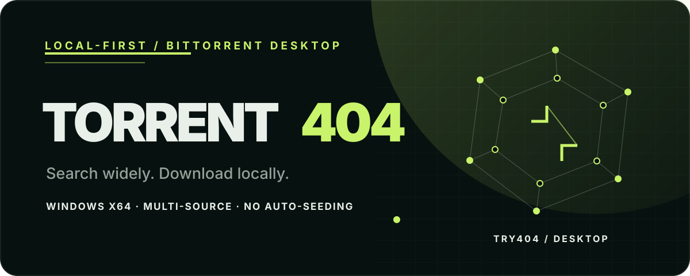
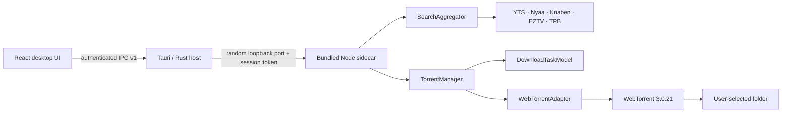
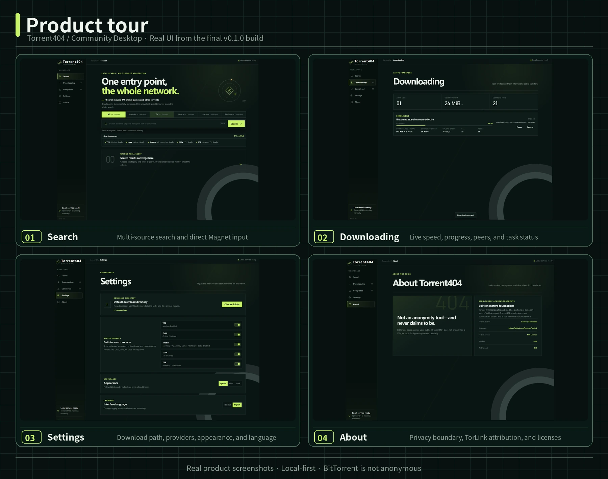

<div align="center">
  
</div>

<h1 align="center">Torrent404</h1>

<p align="center"><strong>A local-first, multi-source BitTorrent search and download desktop app for Windows.</strong></p>

<p align="center">
  <a href="https://torrent.try404.com/">Project website</a> ·
  <a href="README.zh-CN.md">简体中文</a> ·
  <a href="#install-on-windows">Install</a> ·
  <a href="docs/ARCHITECTURE.md">Architecture</a> ·
  <a href="SECURITY.md">Security</a> ·
  <a href="CONTRIBUTING.md">Contributing</a>
</p>

<p align="center">
  <a href="https://github.com/Mavlan/Torrent404/actions/workflows/ci.yml"></a>
  <a href="https://github.com/Mavlan/Torrent404/releases/tag/v0.1.0"></a>
  
  
  
  
  <a href="LICENSE"></a>
</p>

> [!IMPORTANT]
> Torrent404 is built in part on the open-source [TorLink](https://github.com/baairon/torlink) project by baairon / bairon.dev. It uses and modifies portions of TorLink's MIT-licensed code. Torrent404 is an independent downstream project: it is not an official TorLink release, and no endorsement or collaboration is implied.

## Why Torrent404

Torrent404 brings discovery and downloading into one focused Windows application. Searches fan out to enabled providers, results are normalized and deduplicated by info hash, and downloads remain under a local desktop-controlled Core instead of a hosted proxy service.

The v0.1.0 release is deliberately narrow: searchable sources, direct Magnet input, reliable task controls, restart recovery, and explicit opt-in seeding.

## What it does

| Search | Download |
| --- | --- |
| Aggregates YTS, Nyaa, Knaben, EZTV, and TPB | Adds a result or `magnet:?` URI to the local download engine |
| Filters providers by Movies, TV, Anime, Games, and Software | Shows progress, transfer speeds, ETA, peers, and status |
| Isolates provider timeout/failure and deduplicates by info hash | Supports pause, resume, remove, completion, and manual seeding |
| Persists each provider's enabled/disabled preference | Restores incomplete tasks paused and completed tasks offline |

## How it works



The UI and IPC handlers never import WebTorrent directly. State transitions are enforced by `DownloadTaskModel`, while `TorrentManager` is the single control boundary for the engine.

## Product tour



The screenshots above come from the final v0.1.0 Windows build and show the actual desktop interface.

## Install on Windows

Download a v0.1.0 artifact from [GitHub Releases](../../releases):

- `Torrent404_0.1.0_x64-setup.exe` — NSIS installer
- `Torrent404_0.1.0_x64_zh-CN.msi` — zh-CN MSI installer

The default install directory is `%LOCALAPPDATA%\Torrent404\`, and the application executable is `Torrent404.exe`. The release bundles Node.js `v24.20.0` and the complete sidecar production dependency tree; users do not need to install Node.js, Rust, or Git.

v0.1.0 installers are not code-signed. Windows SmartScreen may therefore show an unknown-publisher warning; verify the artifact source before continuing.

## Download and seeding behavior

- Torrent404 does **not** seed automatically after a download reaches 100%.
- Completion detaches active torrent networking and moves the task to **Completed**.
- **Start seeding** is an explicit user action. **Stop seeding** detaches the engine while preserving the task and files.
- Removing a task removes its record and network activity; downloaded files are retained.
- Incomplete tasks restore as paused after restart. Resume uses the original source and path so WebTorrent can verify and reuse existing pieces.
- If you have spare upload bandwidth and your computer will remain online, consider seeding for a while after a download completes. Seeding is entirely optional, but it helps other peers retrieve the data and contributes to a healthier BitTorrent swarm.

## Search sources

All built-in providers are enabled for new profiles; saved user choices always take precedence.

| Provider | Categories | Interface |
| --- | --- | --- |
| YTS | Movies | Public JSON API with fixed host fallback |
| Nyaa | Anime | Public RSS feed |
| Knaben Beta | Movies, TV, Anime, Games, Software | Public JSON API |
| EZTV | TV | Public JSON API |
| TPB | Movies, TV | Public apibay JSON API |

Providers are independent. A timeout or error from one source does not discard results from healthy sources.

## Privacy and network boundaries

**Torrent404 is local-first, but BitTorrent is not anonymous.**

- Search and torrent traffic leave the user's machine directly; Torrent404 does not operate a central proxy.
- BitTorrent peers and trackers can observe the user's public IP address.
- Torrent404 does not provide Tor, VPN, IP masking, or anonymity features.
- The application does not host content. Users are responsible for complying with applicable law and using content they are authorized to access.
- Torrent404 does not bypass logins, paywalls, CAPTCHA, DRM, or access controls.

See [SECURITY.md](SECURITY.md) for the local IPC and disclosure model.

## Development

### Prerequisites

- Windows 10/11 x64
- Node.js `24.20.0`
- Rust stable with the MSVC toolchain
- Microsoft C++ Build Tools and WebView2

### Run and verify

```powershell
npm ci
npm run typecheck
npm test
npm run build
cargo check --locked --manifest-path apps/desktop/src-tauri/Cargo.toml
npm run tauri -- dev
```

Build Windows installers with:

```powershell
npm run tauri -- build
```

## Persistence and compatibility

- Application identifier: `com.try404.torrent404`
- Task state: `%LOCALAPPDATA%\com.try404.torrent404\download-tasks.v1.json`
- Desktop settings: `%LOCALAPPDATA%\com.try404.torrent404\settings.v1.json`
- Source toggles: WebView `localStorage`
- Incomplete tasks restore paused; completed tasks restore offline; a task that was seeding restores as completed.
- The bundled sidecar is pinned to Node.js `v24.20.0`; the current torrent engine is `webtorrent@3.0.21`.

## Technology

Tauri 2 · Rust · React 19 · TypeScript 7 · Vite 8 · Node.js 24.20.0 · WebTorrent 3.0.21 · Zod 4

## Project boundaries

Torrent404 v0.1.0 does not include a hosted search proxy, anonymity layer, automatic seeding, ratio rules, torrent creation/export, metadata/poster services, or a provider plugin SDK. The current release target is Windows x64.

## Upstream and attribution

[TorLink](https://github.com/baairon/torlink) by baairon / bairon.dev is the principal upstream reference and code source for selected provider response mapping and torrent/network behavior. Torrent404 reviewed TorLink at commit `205cabb00c348c2272e1761fbf4b46b682c0c275`, then adapted portions behind its own Core and adapter boundaries.

On that foundation, Torrent404 independently develops its desktop UI, provider architecture, authenticated local IPC, task persistence and restart policy, Windows packaging, and bilingual interface.

Torrent404 is independently maintained, is not affiliated with TorLink, and does not imply upstream endorsement. TorLink's original copyright notice and complete MIT license text are preserved in [THIRD_PARTY_NOTICES.md](THIRD_PARTY_NOTICES.md), alongside WebTorrent and patched `bittorrent-tracker` notices.

## Contributing and security

Read [CONTRIBUTING.md](CONTRIBUTING.md) before proposing a change. Please report vulnerabilities according to [SECURITY.md](SECURITY.md) rather than publishing sensitive details in a public issue.

## License

Torrent404 is released under the [MIT License](LICENSE). Third-party components retain their respective licenses and notices; see [THIRD_PARTY_NOTICES.md](THIRD_PARTY_NOTICES.md).
