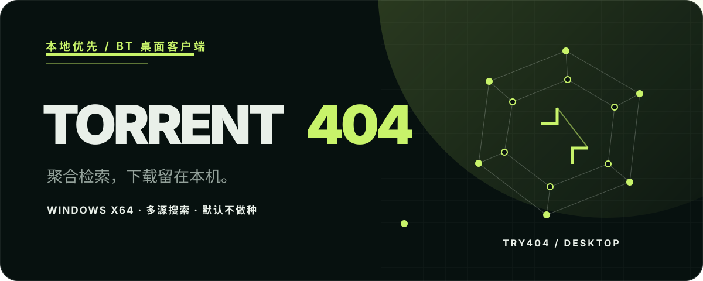
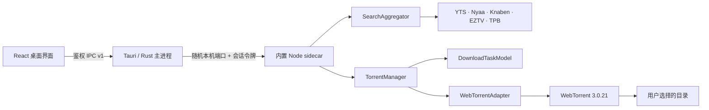
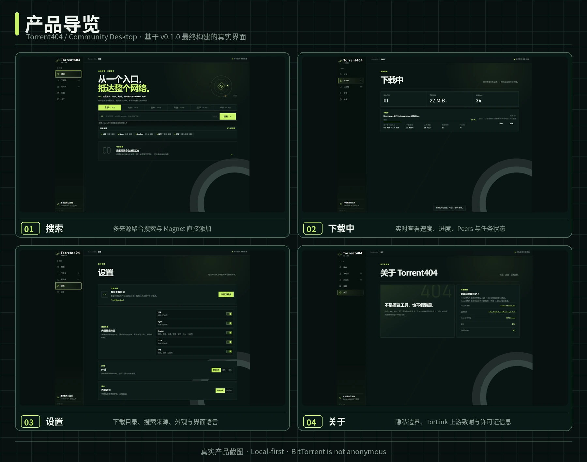

<div align="center">
  
</div>

<h1 align="center">Torrent404</h1>

<p align="center"><strong>本地优先、聚合多来源的 Windows BitTorrent 搜索与下载桌面客户端。</strong></p>

<p align="center">
  <a href="https://torrent.try404.com/">项目主页</a> ·
  <a href="README.md">English</a> ·
  <a href="#windows-安装">安装</a> ·
  <a href="docs/ARCHITECTURE.md">架构</a> ·
  <a href="SECURITY.md">安全</a> ·
  <a href="CONTRIBUTING.md">贡献</a>
</p>
<p align="center">
  <a href="https://github.com/Mavlan/Torrent404/actions/workflows/ci.yml"></a>
  <a href="https://github.com/Mavlan/Torrent404/releases/tag/v0.1.0"></a>
  
  
  
  
  <a href="LICENSE"></a>
</p>

> [!IMPORTANT]
> Torrent404 的部分实现建立在 baairon / bairon.dev 的开源项目 [TorLink](https://github.com/baairon/torlink) 之上，并使用、修改了 TorLink 以 MIT 许可证发布的部分代码。Torrent404 是独立维护的下游项目，不是 TorLink 官方版本，也不代表 TorLink 对本项目的认可或合作关系。

## 为什么选择 Torrent404

Torrent404 把资源发现和下载收进一个专注的 Windows 应用。搜索请求会并行发往用户启用的来源，结果按 info hash 规范化并去重；下载由本机桌面 Core 管理，不经过项目运营的中央代理服务。

v0.1.0 有意保持克制：提供多来源搜索、Magnet 直接添加、可靠的任务控制、重启恢复，以及必须由用户主动开启的做种。

## 主要能力

| 搜索 | 下载 |
| --- | --- |
| 聚合 YTS、Nyaa、Knaben、EZTV 与 TPB | 从搜索结果或 `magnet:?` 链接创建本地下载 |
| 按电影、剧集、动漫、游戏、软件筛选来源 | 展示进度、速度、ETA、Peers 与状态 |
| 隔离单个来源的超时/失败，并按 info hash 去重 | 支持暂停、继续、移除、完成与手动做种 |
| 持久化每个来源的启用/关闭选择 | 未完成任务以暂停状态恢复，已完成任务离线恢复 |

## 工作方式



UI 与 IPC handler 不直接导入 WebTorrent。状态转换由 `DownloadTaskModel` 约束，`TorrentManager` 是上层控制下载引擎的唯一边界。

## 产品导览



以上截图来自最终 v0.1.0 Windows 构建，展示的是 Torrent404 的真实桌面界面。

## Windows 安装

从 [GitHub Releases](../../releases) 下载 v0.1.0 安装包：

- `Torrent404_0.1.0_x64-setup.exe` — NSIS 安装包
- `Torrent404_0.1.0_x64_zh-CN.msi` — zh-CN MSI 安装包

默认安装目录为 `%LOCALAPPDATA%\Torrent404\`，应用程序为 `Torrent404.exe`。发行包已包含 Node.js `v24.20.0` 与 sidecar 的完整 production 依赖，普通用户无需安装 Node.js、Rust 或 Git。

v0.1.0 安装包尚未进行代码签名，因此 Windows SmartScreen 可能显示“未知发布者”提示。继续前请确认安装包来源。

## 下载与做种策略

- 下载达到 100% 后，Torrent404 **不会自动做种**。
- 完成时会断开 Torrent 网络活动，并把任务移动到“已完成”。
- “开始做种”必须由用户主动触发；“停止做种”会卸载引擎，但保留任务和文件。
- 移除任务会删除任务记录并停止网络活动，不删除已下载文件。
- 未完成任务在重启后恢复为暂停；继续时使用原始来源和目录，由 WebTorrent 校验并复用已有数据块。
- 如果你有充足的上行带宽，并且电脑暂时闲置，可以考虑在下载完成后手动做种一段时间。做种完全自愿，但它能帮助其他 Peer 获取数据，也有助于维持 BitTorrent swarm 的可用性。

## 搜索来源

新用户默认启用全部内置来源；已有用户保存的选择始终优先。

| 来源 | 分类 | 接口 |
| --- | --- | --- |
| YTS | 电影 | 公开 JSON API，使用固定 host fallback |
| Nyaa | 动漫 | 公开 RSS feed |
| Knaben Beta | 电影、剧集、动漫、游戏、软件 | 公开 JSON API |
| EZTV | 剧集 | 公开 JSON API |
| TPB | 电影、剧集 | 公开 apibay JSON API |

各来源相互隔离。单个来源超时或报错，不会丢弃其他健康来源的结果。

## 隐私与网络边界

**Torrent404 本地优先，但 BitTorrent 并不匿名。**

- 搜索与 Torrent 流量从用户设备直接发出；Torrent404 不运营中央代理。
- BitTorrent peers 与 trackers 可能看到用户的公网 IP。
- Torrent404 不提供 Tor、VPN、IP 隐藏或匿名功能。
- 软件本身不托管内容；用户应遵守适用法律，只访问有权使用的内容。
- Torrent404 不绕过登录、付费墙、验证码、DRM 或访问控制。

本机 IPC 与漏洞报告方式见 [SECURITY.md](SECURITY.md)。

## 开发

### 环境要求

- Windows 10/11 x64
- Node.js `24.20.0`
- Rust stable（MSVC toolchain）
- Microsoft C++ Build Tools 与 WebView2

### 运行与检查

```powershell
npm ci
npm run typecheck
npm test
npm run build
cargo check --locked --manifest-path apps/desktop/src-tauri/Cargo.toml
npm run tauri -- dev
```

构建 Windows 安装包：

```powershell
npm run tauri -- build
```

## 持久化与兼容性

- Application identifier：`com.try404.torrent404`
- 任务状态：`%LOCALAPPDATA%\com.try404.torrent404\download-tasks.v1.json`
- 桌面设置：`%LOCALAPPDATA%\com.try404.torrent404\settings.v1.json`
- 来源开关：WebView `localStorage`
- 未完成任务恢复为暂停；已完成任务离线恢复；退出时正在做种的任务恢复为已完成。
- sidecar 固定使用内置 Node.js `v24.20.0`，当前 Torrent 引擎为 `webtorrent@3.0.21`。

## 技术栈

Tauri 2 · Rust · React 19 · TypeScript 7 · Vite 8 · Node.js 24.20.0 · WebTorrent 3.0.21 · Zod 4

## 项目边界

Torrent404 v0.1.0 不包含托管式搜索代理、匿名网络层、自动做种、分享率规则、Torrent 创建/导出、海报元数据服务或 Provider 插件 SDK。当前发行目标是 Windows x64。

## 上游项目与致谢

baairon / bairon.dev 的 [TorLink](https://github.com/baairon/torlink) 是 Torrent404 最主要的上游参考和代码来源。项目在 TorLink commit `205cabb00c348c2272e1761fbf4b46b682c0c275` 基础上研究并适配了部分 provider 响应映射与 Torrent/网络行为，再通过自己的 Core 与 adapter 边界进行隔离。

在此基础上，Torrent404 独立开发了桌面 UI、搜索来源架构、本地鉴权 IPC、任务持久化与重启策略、Windows 打包和中英双语界面。

Torrent404 为独立维护的下游项目，与 TorLink 没有隶属关系，也不暗示上游认可。TorLink 的原始版权声明和完整 MIT 许可证文本保留在 [THIRD_PARTY_NOTICES.md](THIRD_PARTY_NOTICES.md)，同一文件也记录了 WebTorrent 与本地 patched `bittorrent-tracker` 的归属。

## 贡献与安全

提交修改前请阅读 [CONTRIBUTING.md](CONTRIBUTING.md)。发现安全问题时，请按 [SECURITY.md](SECURITY.md) 私下报告，不要在公开 issue 中发布敏感细节。

## 许可证

Torrent404 使用 [MIT License](LICENSE) 发布。第三方组件继续适用各自的许可证与通知，详见 [THIRD_PARTY_NOTICES.md](THIRD_PARTY_NOTICES.md)。
