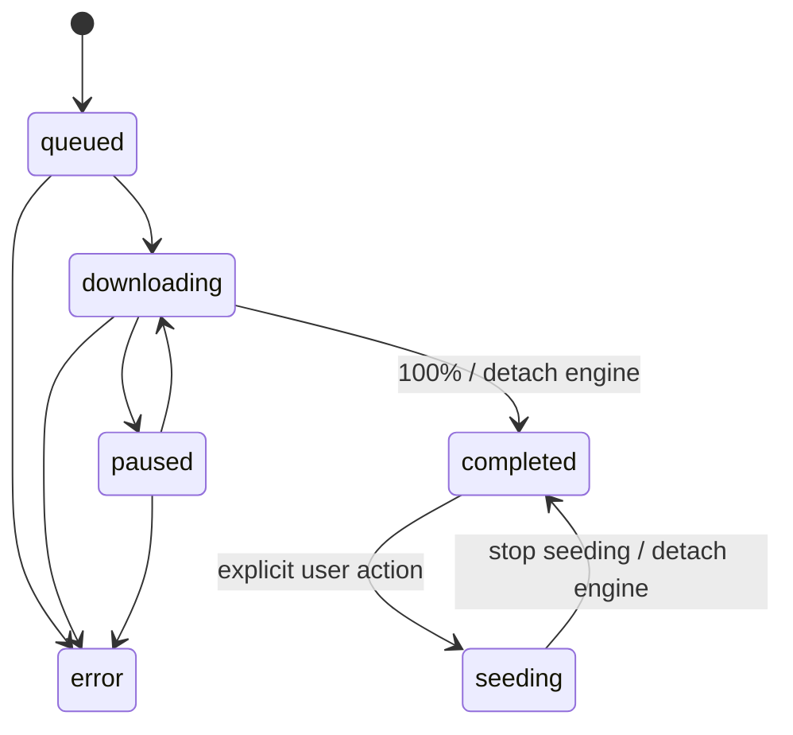

# Torrent404 architecture

Status: v0.1.0 release architecture

Target: Windows 10/11 x64

Application identifier: `com.try404.torrent404`

Principal upstream reference: `baairon/torlink@205cabb00c348c2272e1761fbf4b46b682c0c275`

## Goals

Torrent404 is a local-first BitTorrent search and download desktop application. The
Windows release is self-contained: the user installs `Torrent404.exe` and does not
need Node.js, Rust, Git, or command-line tools.

The architecture separates UI, transport contracts, search, task state, and the
Torrent implementation so upstream API or security changes do not propagate through
the product.

## Components and dependency direction

```mermaid
flowchart TB
  subgraph Desktop[apps/desktop]
    UI[React UI]
    HOST[Tauri 2 / Rust host]
  end

  subgraph Sidecar[Bundled Node 24.20.0 sidecar]
    ROUTER[Authenticated IPC router]
    SEARCH[ProviderRegistry + SearchAggregator]
    MANAGER[TorrentManager]
    MODEL[DownloadTaskModel]
    ADAPTER[WebTorrentAdapter]
  end

  PROTOCOL[packages/protocol]
  I18N[packages/i18n]
  PROVIDERS[YTS · Nyaa · Knaben · EZTV · TPB]
  ENGINE[webtorrent@3.0.21]
  DISK[App data + user download folders]

  UI --> PROTOCOL
  UI --> I18N
  UI --> HOST
  HOST --> ROUTER
  ROUTER --> PROTOCOL
  ROUTER --> SEARCH
  ROUTER --> MANAGER
  SEARCH --> PROVIDERS
  MANAGER --> MODEL
  MANAGER --> ADAPTER
  ADAPTER --> ENGINE
  MANAGER --> DISK
  ENGINE --> DISK
```

The intended dependency direction is `desktop -> protocol <- core` and
`desktop -> i18n`. `packages/protocol` does not depend on React, Tauri, WebTorrent,
or TorLink. UI and IPC handlers do not import WebTorrent; all engine control passes
through `TorrentManager` and the `TorrentEngine` interface.

## Process and authenticated IPC

Tauri starts the bundled sidecar during application setup and terminates it during
shutdown. The sidecar:

1. binds only to `127.0.0.1` on an operating-system-assigned random port;
2. receives a cryptographically random `TORLINK_SESSION_TOKEN` for that launch;
3. reports readiness with its actual port and protocol version;
4. requires the token and compatible protocol version on every command; and
5. returns structured errors for malformed requests, invalid authentication, unknown
   commands, and Core failures.

The token is not persisted or intentionally logged. `ping`, health, search, and all
download commands use the same authenticated IPC v1 transport. Task snapshots are
polled at a bounded desktop interval instead of using a second WebSocket/SSE channel.

## Search

Every source implements the asynchronous `SearchProvider` contract and declares its
categories and default enabled state. `ProviderRegistry` applies saved user choices;
`SearchAggregator` consumes enabled providers concurrently, enforces cancellation and
timeouts, isolates failures, emits incremental results/status, and deduplicates valid
info hashes.

| Provider | Categories | Transport |
| --- | --- | --- |
| YTS | Movies | JSON API with fixed host fallback |
| Nyaa | Anime | RSS |
| Knaben Beta | Movies, TV, Anime, Games, Software | JSON API |
| EZTV | TV | JSON API |
| TPB | Movies, TV | apibay JSON API |

Provider adapters use local fixtures for automated parsing tests. They do not bypass
login, CAPTCHA, paywall, DRM, Cloudflare, or access controls.

## Torrent task lifecycle



`DownloadTaskModel` is the authority for legal state transitions. Torrent completion
does not automatically seed: `TorrentManager` detaches active network state, reports
zero upload speed/peers, and keeps the record under Completed. Starting and stopping
seeding are explicit commands. Removing a task retains downloaded files.

`WebTorrentAdapter` is the only module that imports WebTorrent. It maps engine
metadata, progress, speeds, bytes, ETA, peers, completion, and error events into Core
snapshots.

## Persistence

The desktop supplies the app-data path to the sidecar. v0.1 uses small versioned JSON
stores, not a database:

```text
%LOCALAPPDATA%\com.try404.torrent404\
  download-tasks.v1.json
  settings.v1.json
```

Provider toggles are stored in WebView `localStorage`. The task store contains the
stable source, info hash, display data, save path, size, and durable state required to
recover a task. Speeds, peers, and ETA are transient and are not persisted.

Restart policy prevents automatic network activity:

- incomplete queued/downloading/paused tasks restore as paused;
- completed tasks restore as completed without mounting the engine;
- tasks that were seeding restore as completed;
- resume or start seeding remounts the original source and save path, allowing
  WebTorrent to verify and reuse existing pieces.

Changing the default download directory affects new tasks only. Existing tasks keep
their recorded save paths, and Torrent404 does not move existing files.

## Windows release layout

Tauri builds per-user NSIS and zh-CN MSI x64 installers. The installed application
layout is rooted at `%LOCALAPPDATA%\Torrent404\` and includes:

```text
Torrent404.exe
sidecar\
  node.exe                 # v24.20.0
  bootstrap.mjs
  search-service.mjs
  download-service.mjs
  core\
  node_modules\            # production dependency closure
```

Production path resolution is based on installed resources, not the repository,
working directory, system Node, or developer `PATH`. The Rust supervisor owns the
child process and prevents an orphaned bundled Node process when the window closes.

## Trust and privacy boundaries

- Search requests, tracker/DHT traffic, and peer connections originate from the
  user's machine.
- The sidecar does not accept non-loopback connections or expose a public file server.
- BitTorrent is not anonymous; peers and trackers may observe the user's public IP.
- Torrent404 does not provide Tor, VPN, proxy bypass, or IP masking.
- The project does not host indexed content and does not implement access-control or
  anti-bot bypasses.

## Upstream boundary

[TorLink](https://github.com/baairon/torlink) is the principal upstream reference and
the source of selected adapted provider mapping and torrent/network behavior.
Torrent404 wraps adapted behavior in project-owned contracts rather than depending
on TorLink's terminal UI or internal state objects. It is independently maintained
and is not an official TorLink release.

The original `Copyright (c) 2026 bairon.dev`, complete MIT terms, reviewed revision,
and modification relationship are recorded in
[`THIRD_PARTY_NOTICES.md`](../THIRD_PARTY_NOTICES.md).
